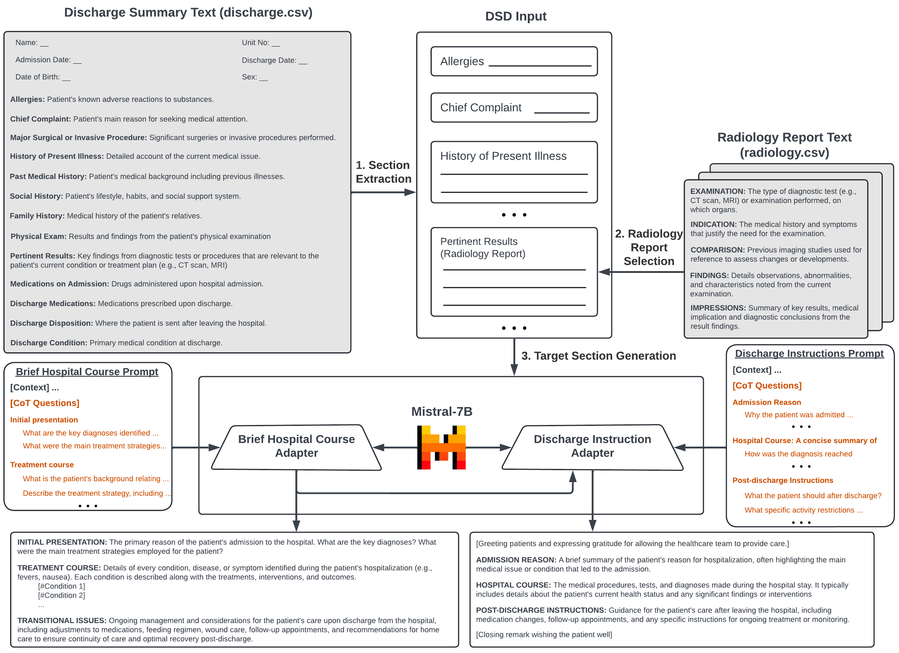

<div align="center">

# Discharge LLM

</div>

This repository maintains the code, data, and model checkpoints for the paper *Chain-of-Thought (CoT) Instruction Finetuning Large Language Models For Discharge Summary Documentation*
It is a part of our approach in the [Discharge Me!](https://www.codabench.org/competitions/2008/) shared task collocated collocated with the 23th Workshop on Biomedical Natural Language Processing (BioNLP).

## Installation
It is recommended to set up the environment and install required libraries using conda. 
It is also recommended that the machine should have GPUs to perform inference at a reasonable time.  
### 1. Create new virtual environment by
```bash
conda create --name pakpa python=3.9
conda activate pakpa
```
### 2. Install Pytorch
#### Windows or Linux
##### Using GPUs
```bash
conda install pytorch torchvision torchaudio pytorch-cuda=11.8 -c pytorch -c nvidia
```
##### Using CPU
```bash
conda install pytorch torchvision torchaudio cpuonly -c pytorch
```
#### Mac
```bash
conda install pytorch::pytorch torchvision torchaudio -c pytorch
```
For other versions, please visit: [https://pytorch.org/get-started/locally/](https://pytorch.org/get-started/locally/)

### 3. Additional packages
We need some additional packages to run the code. The list of packages is listed in ```requirements.txt```. On the main directory of the repository, run:
```bash
pip install -r requirements.txt
```

## Framework

We propose a pipeline framework, namely Discharge-LLM for the Discharge Summary Documentation task, which generates the two critical 'Brief Hospital Course' and 'Discharge Instructions' sections in the discharge summary. 
The above figure illustrates Discharge-LLM framework. 
Given a discharge summary containing various sections and clinical notes from EHR (e.g. progress notes, consult notes, test results), 
Discharge-LLM applies three steps for generating Brief Hospital Course and Discharge Instructions:
- **Stage 1: Section Extraction**
- **Stage 2: Radiology Report Selection**
- **Stage 3: Target Section Generation**

## Inference
```
notebook
├── brief_hospital_course_generation.ipynb
├── discharge_instructions_generation.ipynb
script
├── section_extraction.py
├── radiology_report_selection.py
├── target_section_generation.py
```
### Hosting an instruction-finetuned Mistral LLM for Target Section Generation
We used [FastChat](https://github.com/lm-sys/FastChat/tree/main) to host a Mistral LLMs for prompted generation of the two critical target sections of discharge summaries.
FastChat provides OpenAI-compatible APIs for its supported models, so you can use FastChat as a local drop-in replacement for OpenAI APIs.
The FastChat server is compatible with both [openai-python](https://github.com/openai/openai-python) library and cURL commands.

**Note:** *Mistrial-7B-Instruct-v0.2 is used as the LLMs for the generation tasks. This model requires around 6GB of GPU memory.
For more information to reduce memory requirement or instruction to run on other architectures, please refer to [link](https://github.com/lm-sys/FastChat/tree/main?tab=readme-ov-file#inference-with-command-line-interface)*

First, launch the controller
```bash
python3 -m fastchat.serve.controller
```

Then, launch the model worker(s)

```bash
# For Brief Hospital Course
python3 -m fastchat.serve.model_worker \
  --model-path quangantang/Mistral-7B-Instruct-v0.2-GPTQ-Brief-Hospital-Course \ 
  --gptq-wbits 4 \
  --gptq-groupsize 128 \
  --controller http://localhost:21001 \
  --port 31000 \
  --worker http://localhost:31000
  --host 0.0.0.0
```

```bash
# For Discharge Instructions
python3 -m fastchat.serve.model_worker \
  --model-path quangantang/Mistral-7B-Instruct-v0.2-GPTQ-Discharge-Instructions \ 
  --gptq-wbits 4 \
  --gptq-groupsize 128 \
  --controller http://localhost:21001 \
  --port 31001 \
  --worker http://localhost:31001
  --host 0.0.0.0
```

The pretrained checkpoints can be accessed on Huggingface Hub via:
- https://huggingface.co/quangantang/Mistral-7B-Instruct-v0.2-GPTQ-Brief-Hospital-Course
- https://huggingface.co/quangantang/Mistral-7B-Instruct-v0.2-GPTQ-Discharge-Instructions

Finally, launch the RESTful API server

```bash
python3 -m fastchat.serve.openai_api_server --host localhost --port 8000
```

### Stage 1: Section Extraction
```bash
python scripts/section_extraction.py \ 
    --discharge_summary_path raw/phase_2/discharge.csv.gz \
    --output_file_name raw/phase_2/discharge_extracted.csv.gz
```

### Stage 2: Radiology Report Selection
```bash
python scripts/section_extraction.py \ 
    --extracted_discharge_summary_path raw/phase_2/discharge_extracted.csv.gz
    --radiology_report raw/phase_2/radiology.csv.gz
    --output_file_name raw/phase_2/discharge_processed.csv.gz
```

### Stage 3: Target Section Generation
```bash
python scripts/section_extraction.py \ 
    --processed_discharge_summary_path raw/phase_2/discharge_processed.csv.gz
    --output_file_name raw/phase_2/discharge_target_generated.csv.gz
```